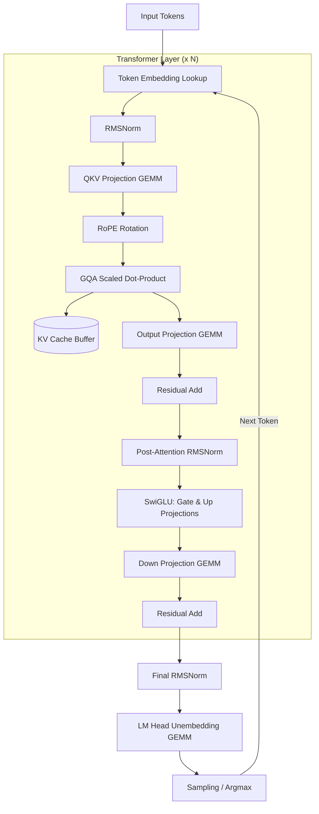
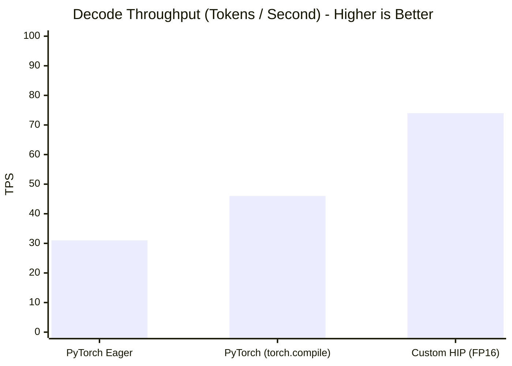
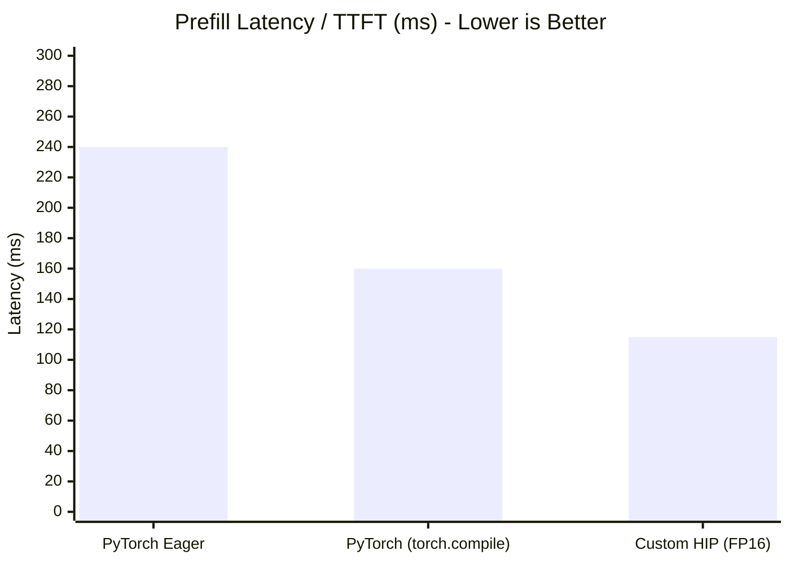

# qwen-hip

A minimal C++ and HIP inference engine for the Qwen 4B architecture (Qwen 3.5 series) running natively on AMD RDNA 2 GPUs (Radeon RX 6800 XT). 

The goal of this project is to implement the autoregressive transformer pipeline from scratch without high-level runtime engines, evaluate operator performance on AMD hardware, and verify numerical correctness against a PyTorch reference implementation.

## Implementation Details

### Operator Support
* **Attention**: Grouped-Query Attention (GQA) with an explicit pre-allocated KV-cache to avoid recomputation during decode.
* **Embeddings**: Rotary Positional Embeddings (RoPE) applied to Q and K projections before computing attention scores.
* **Normalization**: Fused RMSNorm combining sum-of-squares reduction, root-mean-square calculation, and weight scaling into a single kernel pass.
* **Feed-Forward**: Gated SwiGLU MLP ($W_{\text{gate}}$, $W_{\text{up}}$, $W_{\text{down}}$).

### Hardware Targeting (AMD RDNA 2 / RX 6800 XT)
The RX 6800 XT (Navi 21 architecture) has 72 Compute Units and lacks native Bfloat16 hardware execution units. Running BF16 directly incurs an instruction emulation penalty. 

To maximize throughput, the loader casts incoming weights and activations to IEEE 754 half-precision (`__half2`). This utilizes RDNA 2's packed FP16 ALUs, which execute at dual-issue rate (twice the throughput of single-precision FP32).

## Architecture Pipeline



## Benchmarks

Measurements taken on an AMD Radeon RX 6800 XT (16 GB VRAM, 512 GB/s peak bandwidth) on Linux via ROCm 6.x.  
Timing is measured using `hipEventElapsedTime` to exclude host-device synchronization latency.  
Workload: 512 input tokens, 256 generated tokens, Batch Size = 1.

### Decode Generation Speed



### Prefill Latency (Time to First Token)



## Directory Structure

```text
.
├── benches/                # C++ benchmarking harness using hipEvent timing
├── include/
│   ├── gpu_utils.hpp       # HIP error checking, memory allocators, timing macros
│   ├── model_config.hpp    # Parses hyperparameter shapes from config.json
│   └── kernels/
│       └── kernels.hpp     # Declarations for all HIP device functions
├── python/
│   ├── reference.py        # PyTorch reference model and intermediate tensor dumper
│   └── export_weights.py   # Extracts and formats weights from .safetensors files
├── src/
│   ├── main.cpp            # Context management, prompt ingestion, and decode loop
│   └── kernels/
│       └── kernels.hip.cpp # Custom HIP kernels (RMSNorm, RoPE, Attention, GEMM)
├── tests/                  # Layer-by-layer parity tests against PyTorch outputs
└── xmake.lua               # Build script
```

## Build Instructions

### Requirements
* Linux x86_64
* ROCm 6.0+ (`hipcc`)
* xmake
* Python 3.10+ (`torch`, `safetensors`)

### 1. Export Weights and Test Tensors
```bash
cd python
pip install -r requirements.txt

# Generate intermediate activation dumps for kernel testing
python reference.py --model empero-ai/Qwen3.8-4B --dump-activations

# Convert weights from safetensors into a flat binary format
python export_weights.py --model empero-ai/Qwen3.8-4B --output ../weights.bin
cd ..
```

### 2. Compile Engine
```bash
xmake f -m release
xmake
```

### 3. Run Validation Suite
Verifies that each HIP kernel's output matches the PyTorch reference values within an absolute error tolerance ($\epsilon < 10^{-4}$):
```bash
xmake run test_kernels
```

### 4. Run Inference and Benchmarks
```bash
# Run interactive generation
xmake run qwen_infer --weights weights.bin --prompt "Write an LRU cache in C++" --max-tokens 256

# Run performance benchmark suite
xmake run bench_runner --weights weights.bin --warmup 10 --iterations 50
```

## Profiling

Generate execution traces and hardware metrics for inspection in Radeon GPU Profiler (RGP):

```bash
rocprof --sys-trace --hip-trace -d ./profiler_out xmake run qwen_infer --weights weights.bin
```